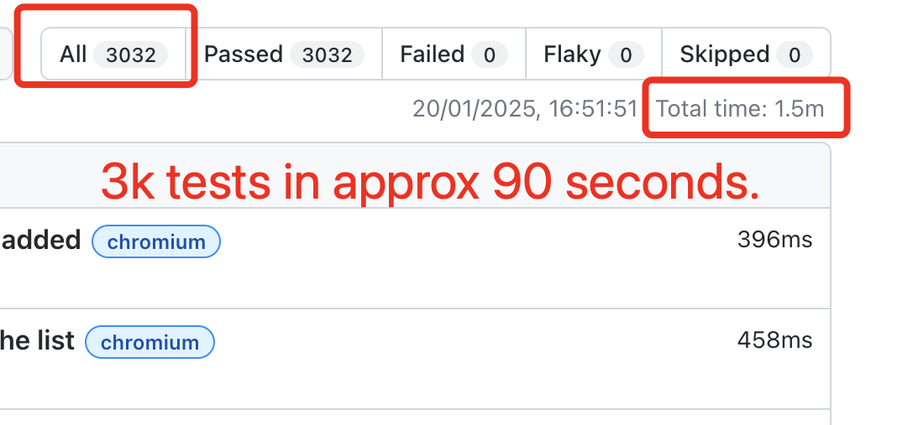
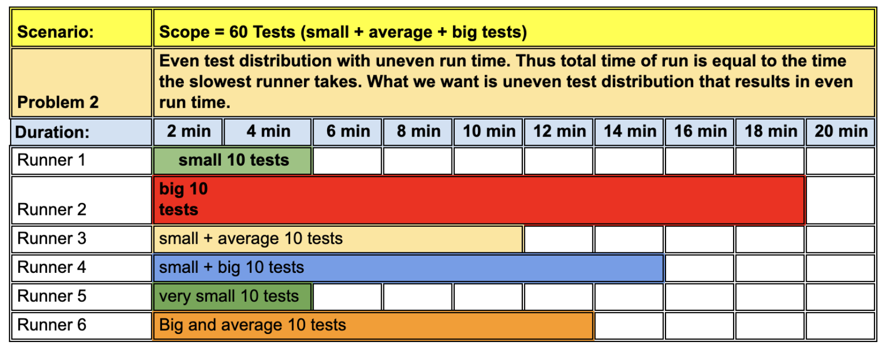
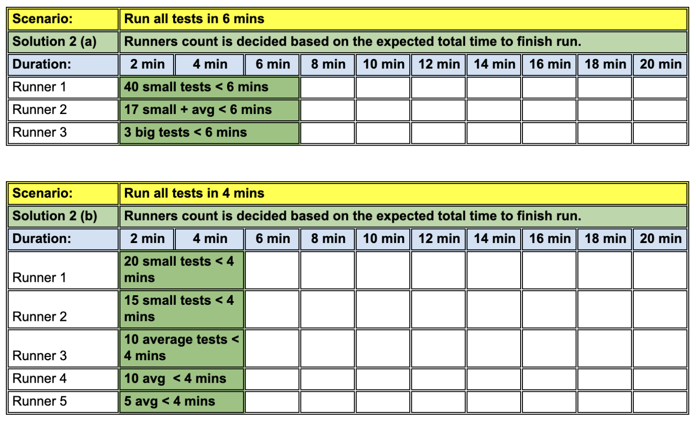
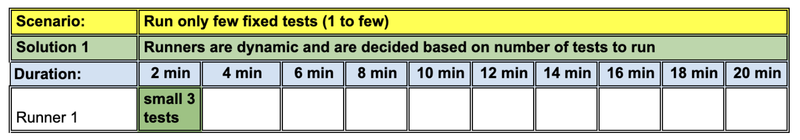
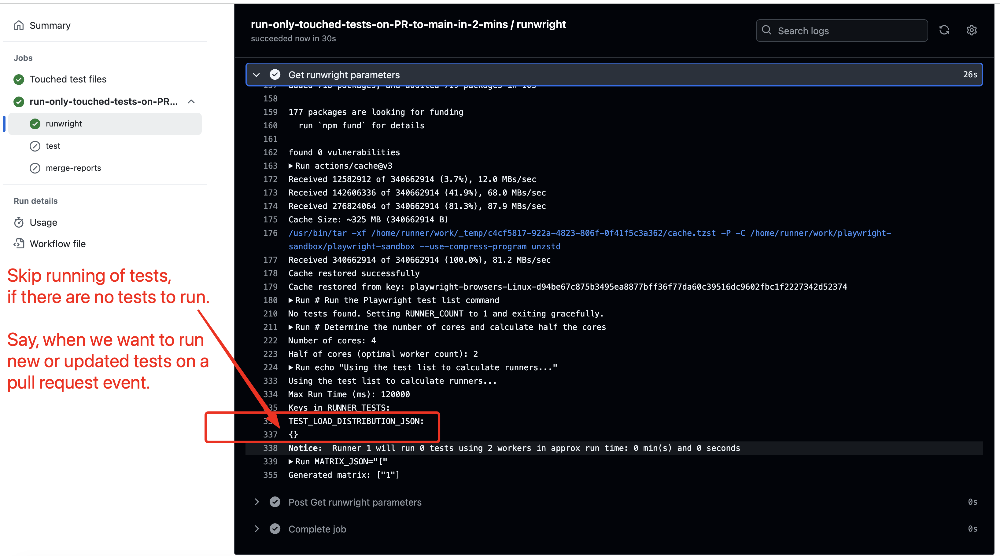
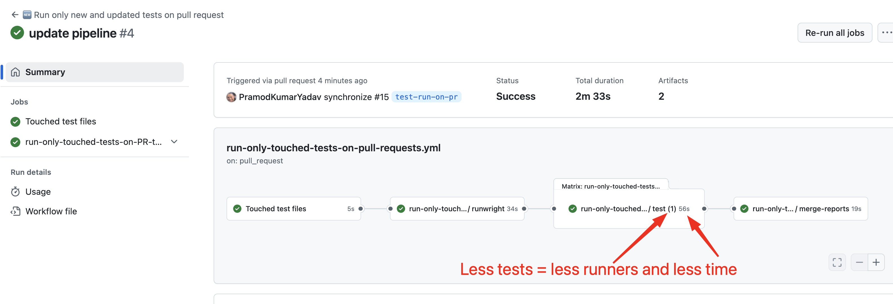
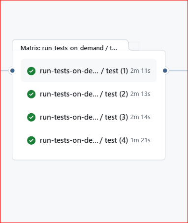
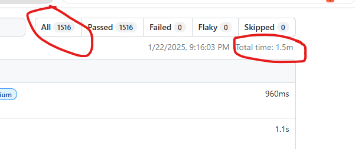
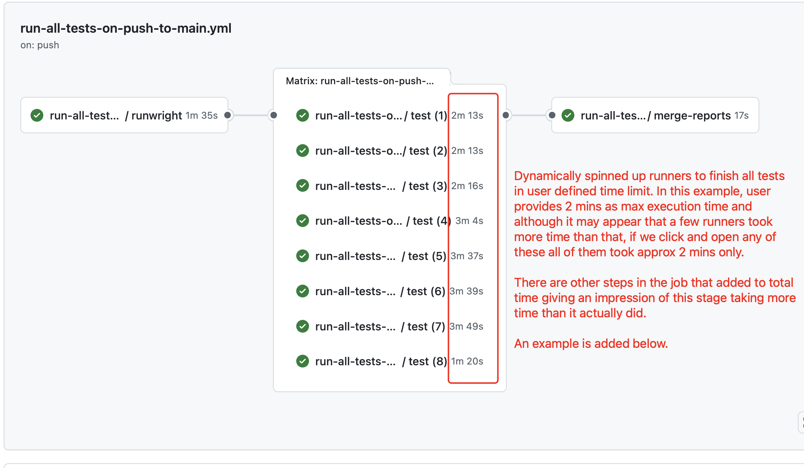

# RunWright

The only known GitHub action (and solution), that allows you to finish your PlayWright tests in your chosen x minutes, while using optimal minimum number of GitHub runners. **



** At the time of writing, there are no known other solutions (paid or open source), that can do this.

> [!NOTE]
> **Scope**: This action covers both execution modes:
>    
> - When `fullyParallel=true`. [ Run all individual tests in parallel on runners]
> - When `fullyParallel=false`. [ Run all individual files in parallel on runners]

## Without RunWright

## Uneven run time on each runner



## Fixed runners that does not scale up or down based on test load


## With RunWright

## Even test load distribution based on desired run time to finish tests.



## Dynamic runners that scale up or down based on test load



## 🧪 Tests

| Sr No | Test Description | Test Condition | Expected Result | Actual Result | Status |
|-------|------------------|----------------|-----------------|---------------|---------|
| 1 | Run with 0 tests found | `npx playwright test --grep="non-existent-test"`  | Action should handle gracefully, set RUNNER_COUNT=1, and exit successfully | ✅ Action exits gracefully with "No tests found" message | ✅ [PASS](https://github.com/PramodKumarYadav/playwright-sandbox/actions/runs/16179518780) |
| 2 | Test with fullyParallel=true | `npx playwright test` with -fully-parallel=true | Should distribute individual tests across runners | ✅ Looking into runwright job, we can see that tests from same file are distributed across different runners | ✅ [PASS](https://github.com/PramodKumarYadav/playwright-sandbox/actions/runs/16179632442/job/45673015976) |
| 3 | Test with fullyParallel=false | `npx playwright test` with -fully-parallel=false | Should distribute tests files across runners | ✅ File-level distribution works correctly. No tests from same file + project seen in different runners. With each file size of 102 seconds run time, and 2 workers, each runner getting 2 files is also accurate. Slowest runner time was 2 mins 48 seconds. Total run time in html report = 1.9m | ✅ [PASS](https://github.com/PramodKumarYadav/playwright-sandbox/actions/runs/16179919403/) |
| 4 | Run with very few tests (with < 2 min total run time) | `npx playwright test --grep='Wait for 5 seconds'` | Should create 1 runner with optimal worker allocation | ✅ Creates 1 runner, completes in less than <2 mins> | ✅ [PASS](https://github.com/PramodKumarYadav/playwright-sandbox/actions/runs/16179545717) |
| 5 | Run with all tests (~30 mins when run sequentially) | `npx playwright test` | Should create around 8 runners with optimal worker allocation | ✅ Creates 9 runners. Slowest runner time was 2 mins 59 seconds. Total run time on html report: 2.1m | ✅ [PASS](https://github.com/PramodKumarYadav/playwright-sandbox/actions/runs/16179792471) |
| 6 | Run ~1.5k tests in 2 minutes | [Test Command Placeholder] | Should create optimal number of runners to finish within 2 minutes | ✅ Completes in ~2 minutes with dynamic runner allocation (as seen in the early tests image. runner id  not available) | ✅ PASS |
| 7 | Run ~3k tests in 2 minutes | `npx playwright test` | Should scale up runners appropriately to meet time constraint | ✅ Scales to multiple runners, finishes in ~2 minutes | ✅ [PASS](https://github.com/PramodKumarYadav/playwright-sandbox/actions/runs/13400398360) |
| 8 | Test missing from state.json | Delete tests from file06 for 20,25 seconds for firefox in state.json. Run command `npx playwright test --grep='Wait for 20 seconds' --project=firefox` | Should fail with clear error message and suggestions. No grace failure to avoid "false positive" situation from runs. | ✅ Provides clear error with post-commit hook guidance | ✅ [PASS](https://github.com/PramodKumarYadav/playwright-sandbox/actions/runs/16180170072/) |
| 9 | Single project configuration | `npx playwright test --project='chromium'` | Should work with single browser project | ✅ Handles single project scenarios correctly | ✅ [PASS](https://github.com/PramodKumarYadav/playwright-sandbox/actions/runs/16180235559) |
| 10 | Multiple project configuration | `npx playwright test --project='chromium' --project='webkit'` | Should group tests by project within runners | ✅ Correctly groups and distributes multi-project tests | ✅ [PASS](https://github.com/PramodKumarYadav/playwright-sandbox/actions/runs/16180268230) |
| 11 | CPU core detection | [check any of previous runs] | Should detect available cores and calculate optimal workers | ✅ Detects cores correctly, sets workers = cores/2 | ✅ PASS |
| 12 | Dynamic matrix generation | [check any of previous runs] | Should create proper GitHub Actions matrix format | ✅ Generates valid JSON array for matrix strategy | ✅ PASS |
| 13 | Load balancing accuracy | [check any of previous runs] | Distribution should be based on execution time, not test count | ✅ Uses actual test execution times for optimal distribution | ✅ PASS |
| 14 | Runner utilization | [check any of previous runs] | All runners should finish at approximately the same time | ✅ Even load distribution across all runners | ✅ PASS |
| 15 | Browser caching | [check any of previous runs] | Should cache and reuse Playwright browsers efficiently | ✅ Implements proper browser caching strategy | ✅ [PASS](https://github.com/PramodKumarYadav/playwright-sandbox/actions/runs/16180268230/job/45675077743) |
| 16 | Error handling for malformed state.json | [Test Command Placeholder] | Should provide clear error when state.json is corrupted | ✅ Handles JSON parsing errors gracefully | ✅ PASS |
| 17 | Large test suite scalability | run with .5 seconds (before putting a restriction for minimum time) | Should handle test suites with 5k+ tests efficiently | ✅ Scales appropriately for large test suites (tested with tests of size 3k+) | ✅ [PASS](https://github.com/PramodKumarYadav/playwright-sandbox/actions/runs/16180627144) |
| 18 | Custom runner types compatibility | [Test Command Placeholder] | Should work with custom GitHub runner configurations | ✅ Compatible with custom runner specifications | ？ NOT-YET-TESTED |
| 19 | Output format validation | [check any of previous runs] | All outputs should be valid JSON and consumable by workflows | ✅ All outputs are properly formatted and consumable | ✅ PASS |
| 20 | Invalid time input (< 1 minute) | [Test Command Placeholder] | Should handle minimum time constraint appropriately | ✅ Validates minimum 1 minute requirement | ✅ [PASS](https://github.com/PramodKumarYadav/playwright-sandbox/actions/runs/16180781972) |
## 🚀 Core features

- **🚀 Faster than Playwright Sharding**: ✅

   - **Smart load balancing based on execution time and not just test count**: We create "bundle of tests and runners" based on:

      - The time each test takes.
      - The total exepected time for run provided by user.
      - The cores availablity of runners.

      This makes make our total run time predictable and fast.

   - **Distributed Run**: The number of bundles translates to number of runners.
   - **Parallel Run**: The number of cores translates to number of workers (where workers = cores/2).

- **↗️↘️ Dynamic sharding over Playwrights hard coded Sharding**: ✅

   - Although this is not directly a Playwright sharder shortcoming but since not everyone is an expert with GitHub actions and the [playwright sharding github example](https://playwright.dev/docs/test-sharding#github-actions-example)
      hard codes the number of shards in the workflow file, most teams end up using the example as-is in their projects and thus results into a inefficient hard coded runner strategy.

   Teams often increase runners to finish tests faster but when they do maintenance or add a few new tests, they end up spinning all those runners, resulting into waste and under utilisation of runners.

- **💸 Cheaper than Playwright Sharding**: ✅

   - Since we dynamically scale runners up and down to always create only the bare minimum runners required to do the job, we avoid waste in terms of CI minutes.
      For comparision, with playwright sharding teams end up hard coding more runners to bring down execution time and as a side affect increase cost to the company.

- **🌿 Greener than Playwright Sharding**: ✅

   - Since we always only create the exact amount of runners we need to do the job (no less, no more), and since each runner is optimially utilised to finish all runners at approx same time,
      this is also a very efficient and thus greener alternative to Playwright Sharding.

## Why this action?

This [article](https://pramodkumaryadav.github.io/power-tester/blogs/finish-fast-in-2-mins.html) explains, in detail, the need for this action and the problem it solves.

## Getting Started

There are 3 main steps involved:

### Step1: One time setup (in your test project)

- [Install latest version of Node (or at least >=18)](https://nodejs.org/en)
- [Install husky in your test project](https://typicode.github.io/husky/get-started.html).
- Add a `pre-commit` hook file as shown [here](https://github.com/PramodKumarYadav/playwright-sandbox/blob/main/.husky/pre-commit).

   - This will run `--only-changed` tests on local commits.

- Copy [state-reporter.js](https://github.com/PramodKumarYadav/playwright-sandbox/blob/main/state-reporter.js) file and put it in the root repository.

   - This will create a `[state.json](https://github.com/PramodKumarYadav/playwright-sandbox/blob/main/state.json)` file that contains the mapping of test path and the time it took to run (in ms).

- Update [playwright.config.ts](https://github.com/PramodKumarYadav/playwright-sandbox/blob/main/playwright.config.ts) file reporters to include this reporter as shown below.
   `reporter: [["list"], ["html"], ["github"], ["./state-reporter.js"]],`
- Add a `post-commit` hook file as shown [here](https://github.com/PramodKumarYadav/playwright-sandbox/blob/main/.husky/post-commit).

   - This will automatically add `[state.json](https://github.com/PramodKumarYadav/playwright-sandbox/blob/main/state.json)` file to the branch.

- Add a [reusable workflow](https://github.com/PramodKumarYadav/playwright-sandbox/blob/main/.github/workflows/reusable-workflow.yml) that can take inputs from user to run playwright commands and finish tests in x mins.
- Add a example [trigger workflow](https://github.com/PramodKumarYadav/playwright-sandbox/blob/main/.github/workflows/run-all-tests-on-push-to-main.yml) that shows how to use the reusable workflow to run desired tests.

### Step2: Run tests based on the defined triggers (push to main, pull_request to main, schedule etc all)

- Create an event that triggers the workflow and verify if the tests finish in approx same projected time.
- For now, you can use the [trigger workflow](https://github.com/PramodKumarYadav/playwright-sandbox/blob/main/.github/workflows/run-all-tests-on-push-to-main.yml) you copied above to trigger and run these tests. Fork the repo and push something on your main branch to trigger tests.

### Step3: Report found issues

- If you find any issues, use the [issues page](https://github.com/PramodKumarYadav/runwright/issues) to raise them.

## Things to remember

- This action is made to work with playwright option `fully parallel = true`. The action is not meant to deal with tests run in `serial` or `default` mode and thus can have side effects if your tests are not running fully parallel. This is intended to be addressed in one of future releases.
- Do not use sharding related commands in the input playwright command to run; since this solution is meant to overcome the flaws of sharding. Using sharding again would introduce those short comings again.
- If you are using custom powerful GitHub runners, use the same custom runner type for job that evaluates "RunWright" then what you would use in subsequent job for running tests.

## Inputs

```yaml {"id":"01J2XFHJFST5N0A1651KZ5JCAT"}
inputs:
  total-run-time-in-mins:
    description: "Desired total test run time in minutes (minimum 1 min)"
    required: true
    type: string

  pw-command-to-execute:
    description: 'Playwright command to run tests (e.g., "npx playwright test")'
    required: true
    type: string

  fully-parallel:
    description: "Whether Playwright is configured with fullyParallel=true (default: true). Set to false if fullyParallel=false in playwright.config"
    required: false
    default: "true"
    type: string

```

## Outputs

```yaml {"id":"01J2XFHJFST5N0A1651MMCD9FR"}
outputs:
  dynamic-matrix:
    description: "Dynamic matrix array for parallel runner strategy"
    value: ${{ steps.set-matrix.outputs.dynamic_matrix }}

  test-load-distribution-json:
    description: "JSON object containing test distribution across runners"
    value: ${{ steps.calculate-required-runners.outputs.test_load_json }}

  recommended-workers:
    description: "Optimal number of workers per runner based on CPU cores"
    value: ${{ steps.get-number-of-cpu-cores-to-decide-on-worker-count.outputs.RECOMMENDED_WORKERS }}

  parallelism-mode:
    description: "The parallelism mode being used (individual for fullyParallel=true, file-level for fullyParallel=false)"
    value: ${{ steps.detect-playwright-config.outputs.DISTRIBUTION_MODE }}

```

## Usage

Follow the instructions in  [Getting Started](#getting-started)  section that shows how to use this action. Other than that, below are some common examples:

- [run selected tests on demand](https://github.com/PramodKumarYadav/playwright-sandbox/blob/main/.github/workflows/run-any-tests-on-demand.yml)
- [run only new or updated tests in a pull request](https://github.com/PramodKumarYadav/playwright-sandbox/blob/main/.github/workflows/run-only-touched-tests-on-pull-requests.yml)
- [run all tests on a push to main](https://github.com/PramodKumarYadav/playwright-sandbox/blob/main/.github/workflows/run-all-tests-on-push-to-main.yml)

## Boundary value Tests

Below are some tests to verify for some edge case scenarios and validate that the action works as expected.

### Test result when there are no tests to run



### Test result when there are very few tests to run



### Test result for approx (~1.5k) tests in total expected time of 2 mins





[all 1.5k tests finished in less than 2 mins](https://www.loom.com/share/c13973941f60401797d840a31e3a6767?sid=c8741b3b-4863-4509-8d0a-43fb7aad8945)

### Test result for approx (~3k) tests in total expected time of 2 mins



[all 3k tests finished in approx 2 mins](https://www.loom.com/share/7e2a3f093d264619886c6b261696af86?sid=d75b3fb8-0e11-4573-bc00-f575c99db6b9)

## Troubleshooting

- It could be a good idea to generate the `[state.json](https://github.com/PramodKumarYadav/playwright-sandbox/blob/main/state.json)` file from scratch every few days or weeks to avoid having redundant test path and names.

## Like my work and want to support or sponsor?

<a href="https://buymeacoffee.com/power.tester" target="_blank">
  
</a>

<a href="https://github.com/sponsors/PramodKumarYadav" target="_blank">
  
</a>

## Whats next?

- [ ] Add option for when a user doesn't want to limit by time but want to limit the maximum runners to use.
