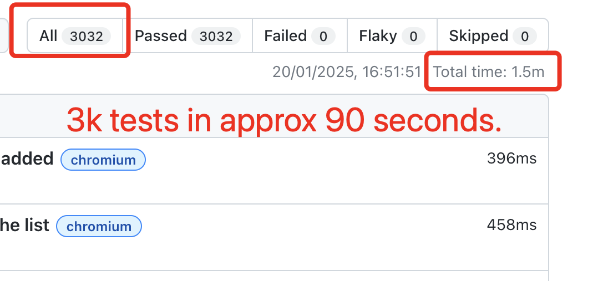
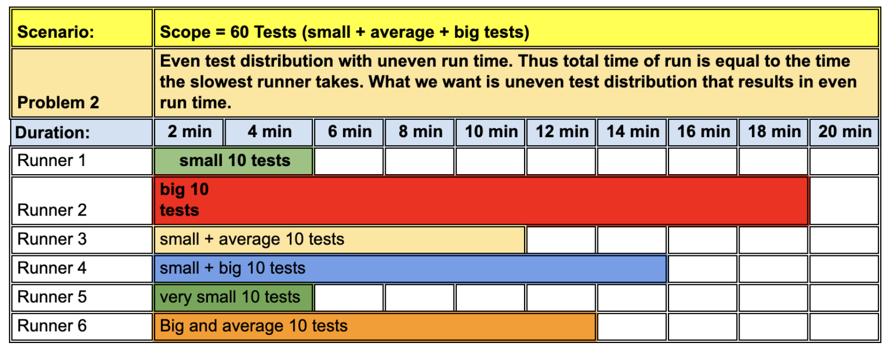
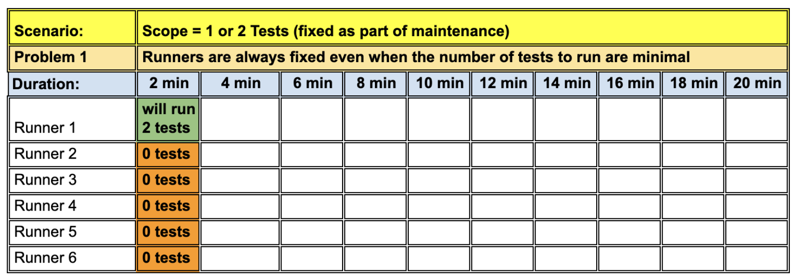
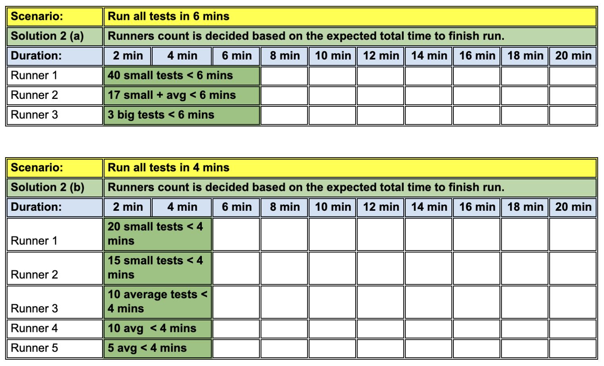
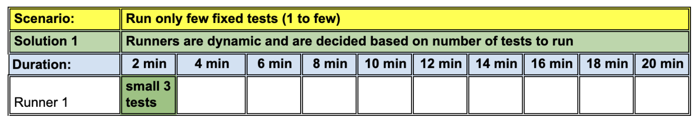
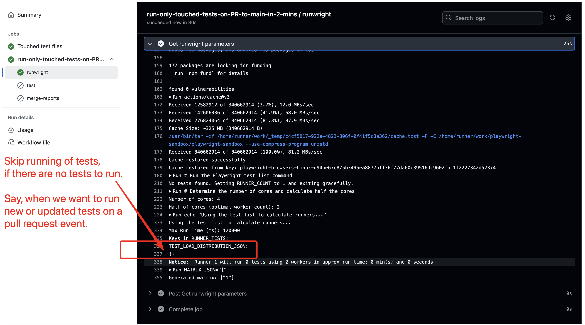
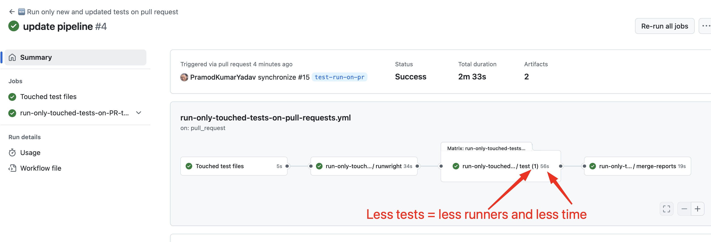
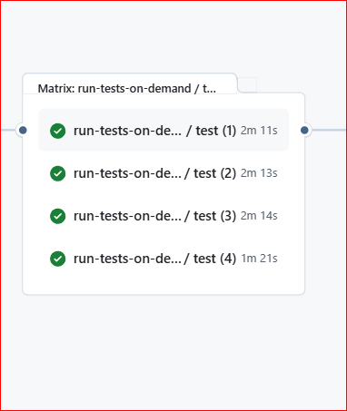
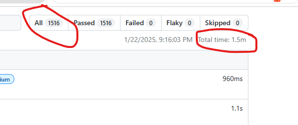
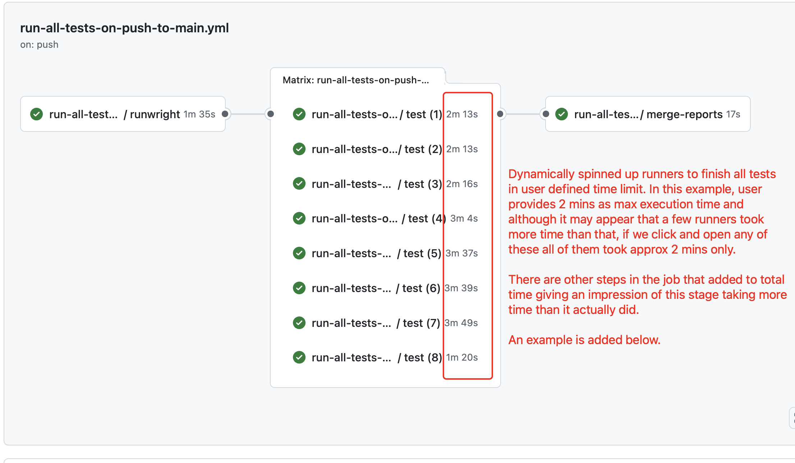

# RunWright

The only known GitHub action (and solution), that allows you to finish your PlayWright tests in your chosen x minutes, while using optimal minimum number of GitHub runners. **



** At the time of writing, there are no known other solutions (paid or open source), that can do this.

> [!NOTE]
> **Scope**: This action covers both execution modes:
>    
> - When `fullyParallel=true`. [ Run all individual tests in parallel on runners]
> - When `fullyParallel=false`. [ Run all individual files in parallel on runners]

## Usage (v3)
```
# Save filename as say run-tests-on-demand.yml
name: 🔘 Run tests on demand

on:
  # Allows us to run this workflow manually from the Actions tab
  workflow_dispatch:
    inputs:
      total-run-time-in-mins:
        description: "Total expected run time in minutes"
        required: true
        default: "2"
        type: string

      pw-command-to-execute:
        description: "playwright command to run"
        required: true
        default: "npx playwright test --project='chromium'"
        type: string

      fully-parallel:
        description: "Run tests in fully parallel mode"
        required: false
        default: "true"
        type: choice
        options:
          - "true"
          - "false"

jobs:
  runwright:
    runs-on: ubuntu-latest
    outputs:
      dynamic_matrix: ${{ steps.runwright-action.outputs.dynamic-matrix }}
      recommended_workers: ${{ steps.runwright-action.outputs.recommended-workers }}
      parallelism-mode: ${{ steps.runwright-action.outputs.parallelism-mode }}
      playwright-args-per-runner: ${{ steps.runwright-action.outputs.playwright-args-per-runner }}
    steps:
      - name: Get runwright parameters
        uses: PramodKumarYadav/runwright@v3.0.0
        id: runwright-action
        with:
          total-run-time-in-mins: ${{ inputs.total-run-time-in-mins }}
          pw-command-to-execute: ${{ inputs.pw-command-to-execute }}
          fully-parallel: ${{ inputs.fully-parallel }}

  test:
    # Only run this job if playwright-args-per-runner has some tests to run.
    if: ${{ needs.runwright.outputs.playwright-args-per-runner != '{}' }}
    timeout-minutes: 60
    needs: runwright
    runs-on: ubuntu-latest
    environment: dev
    container:
      image: mcr.microsoft.com/playwright:v1.50.1-jammy
    strategy:
      fail-fast: false
      matrix:
        runner: ${{ fromJSON(needs.runwright.outputs.dynamic_matrix) }}
    steps:
      - name: Checkout Repository
        uses: actions/checkout@v4
        with:
          fetch-depth: 0

      - name: Mark Repository as Safe
        run: git config --global --add safe.directory $GITHUB_WORKSPACE

      - name: Setup Node
        uses: actions/setup-node@v4
        with:
          node-version: 18

      - name: Install project dependencies
        run: npm ci

      - name: Install jq to parse JSON in the next step
        run: apt-get update && apt-get install -y jq

      - name: Run Playwright Tests for Runner ${{ matrix.runner }}
        env:
          HOME: /root
        run: |
          # Get the ready-to-use Playwright command for this runner
          PLAYWRIGHT_ARGS_JSON='${{ needs.runwright.outputs.playwright-args-per-runner }}'
          RUNNER_KEY="${{ matrix.runner }}"

          # Extract the command for current runner
          PLAYWRIGHT_COMMAND=$(echo "$PLAYWRIGHT_ARGS_JSON" | jq -r --arg key "$RUNNER_KEY" '.[$key]')

          if [ "$PLAYWRIGHT_COMMAND" != "null" ] && [ -n "$PLAYWRIGHT_COMMAND" ]; then
            echo "🚀 Running Playwright tests for Runner $RUNNER_KEY..."
            echo "⚙️  Parallelism Mode: ${{ needs.runwright.outputs.parallelism-mode }}"
            echo "👥 Workers: ${{ needs.runwright.outputs.recommended_workers }}"
            echo "Command: $PLAYWRIGHT_COMMAND"
            
            # Create directory for blob reports
            mkdir -p add-all-blob-reports
            
            # Execute the command and move blob reports
            eval "$PLAYWRIGHT_COMMAND"
            if [ -d "blob-report" ]; then
              mv blob-report/* add-all-blob-reports/ 2>/dev/null || true
            fi
          else
            echo "⚠️  No tests assigned to Runner $RUNNER_KEY"
          fi

      - name: Upload blob report to GitHub Actions Artifacts
        if: always()
        uses: actions/upload-artifact@v4
        with:
          path: add-all-blob-reports/
          name: blob-report-${{ matrix.runner }}
          retention-days: 1

  merge-reports:
    # Merge reports after playwright-tests, even if some shards have failed
    if: ${{ needs.test.result != 'cancelled' && needs.test.result != 'skipped' }}
    needs: [test]
    runs-on: ubuntu-latest
    steps:
      - uses: actions/checkout@v4

      - uses: actions/setup-node@v4
        with:
          node-version: lts/*

      - name: Install dependencies
        run: npm ci

      - name: Download blob reports from GitHub Actions Artifacts
        uses: actions/download-artifact@v4
        with:
          path: all-blob-reports
          pattern: blob-report-*
          merge-multiple: true

      - name: Merge into HTML Report
        run: npx playwright merge-reports --reporter html ./all-blob-reports

      - name: Upload HTML report
        uses: actions/upload-artifact@v4
        with:
          name: html-report--attempt-${{ github.run_attempt }}
          path: playwright-report
          retention-days: 14
```

## Usage (v2 and below. Also some practical use cases with reusable worflows design)

Follow the instructions in  [Getting Started](#getting-started)  section that shows how to use this action. Other than that, below are some common examples that covers usage in v2 with some reusable workflows:

- [run selected tests on demand](https://github.com/PramodKumarYadav/playwright-sandbox/blob/main/.github/workflows/run-any-tests-on-demand.yml)
- [run only new or updated tests in a pull request](https://github.com/PramodKumarYadav/playwright-sandbox/blob/main/.github/workflows/run-only-touched-tests-on-pull-requests.yml)
- [run all tests on a push to main](https://github.com/PramodKumarYadav/playwright-sandbox/blob/main/.github/workflows/run-all-tests-on-push-to-main.yml)

NOTE: As a assignment, see if you can convert the above example of v3 in a reusable workflow with triggers as shown in above URLs.

## Without RunWright

## Uneven run time on each runner



## Fixed runners that does not scale up or down based on test load



## With RunWright

## Even test load distribution based on desired run time to finish tests.



## Dynamic runners that scale up or down based on test load



## 🚀 Core features

- **🚀 Faster than Playwright Sharding**: ✅

   - **Smart load balancing based on execution time and not just test count**: We create "bundle of tests and runners" based on:

      - The time each test takes.
      - The total exepected time for run provided by user.
      - The cores availablity of runners.

      This makes make our total run time predictable and fast.

   - **Distributed Run**: The number of bundles translates to number of runners.
   - **Parallel Run**: The number of cores translates to number of workers (where workers = cores/2).

- **↗️↘️ Dynamic sharding over Playwrights hard coded Sharding**: ✅

   - Although this is not directly a Playwright sharder shortcoming but since not everyone is an expert with GitHub actions and the [playwright sharding github example](https://playwright.dev/docs/test-sharding#github-actions-example)
      hard codes the number of shards in the workflow file, most teams end up using the example as-is in their projects and thus results into a inefficient hard coded runner strategy.

   Teams often increase runners to finish tests faster but when they do maintenance or add a few new tests, they end up spinning all those runners, resulting into waste and under utilisation of runners.

- **💸 Cheaper than Playwright Sharding**: ✅

   - Since we dynamically scale runners up and down to always create only the bare minimum runners required to do the job, we avoid waste in terms of CI minutes.
      For comparision, with playwright sharding teams end up hard coding more runners to bring down execution time and as a side affect increase cost to the company.

- **🌿 Greener than Playwright Sharding**: ✅

   - Since we always only create the exact amount of runners we need to do the job (no less, no more), and since each runner is optimially utilised to finish all runners at approx same time,
      this is also a very efficient and thus greener alternative to Playwright Sharding.

## Why this action?

This [article](https://pramodkumaryadav.github.io/power-tester/blogs/finish-fast-in-2-mins.html) explains, in detail, the need for this action and the problem it solves.

## Getting Started

There are 3 main steps involved:

### Step1: One time setup (in your test project)

- [Install latest version of Node (or at least >=18)](https://nodejs.org/en)
- [Install husky in your test project](https://typicode.github.io/husky/get-started.html).
- Add a `pre-commit` hook file as shown [here](https://github.com/PramodKumarYadav/playwright-sandbox/blob/main/.husky/pre-commit).

   - This will run `--only-changed` tests on local commits.

- Copy [state-reporter.js](https://github.com/PramodKumarYadav/playwright-sandbox/blob/main/state-reporter.js) file and put it in the root repository.

   - This will create a `[state.json](https://github.com/PramodKumarYadav/playwright-sandbox/blob/main/state.json)` file that contains the mapping of test path and the time it took to run (in ms).

- Update [playwright.config.ts](https://github.com/PramodKumarYadav/playwright-sandbox/blob/main/playwright.config.ts) file reporters to include this reporter as shown below.
   `reporter: [["list"], ["html"], ["github"], ["./state-reporter.js"]],`
- Add a `post-commit` hook file as shown [here](https://github.com/PramodKumarYadav/playwright-sandbox/blob/main/.husky/post-commit).

   - This will automatically add `[state.json](https://github.com/PramodKumarYadav/playwright-sandbox/blob/main/state.json)` file to the branch.

- Add a [reusable workflow](https://github.com/PramodKumarYadav/playwright-sandbox/blob/main/.github/workflows/reusable-workflow.yml) that can take inputs from user to run playwright commands and finish tests in x mins.
- Add a example [trigger workflow](https://github.com/PramodKumarYadav/playwright-sandbox/blob/main/.github/workflows/run-all-tests-on-push-to-main.yml) that shows how to use the reusable workflow to run desired tests.

### Step2: Run tests based on the defined triggers (push to main, pull_request to main, schedule etc all)

- Create an event that triggers the workflow and verify if the tests finish in approx same projected time.
- For now, you can use the [trigger workflow](https://github.com/PramodKumarYadav/playwright-sandbox/blob/main/.github/workflows/run-all-tests-on-push-to-main.yml) you copied above to trigger and run these tests. Fork the repo and push something on your main branch to trigger tests.

### Step3: Report found issues

- If you find any issues, use the [issues page](https://github.com/PramodKumarYadav/runwright/issues) to raise them.

## Things to remember

- This action is made to work with both playwright options `fully parallel = true` and `fully parallel = false`. If you see any side effects while using this action, please raise a issue. 
- Do not use sharding related commands in the input playwright command to run; since this solution is meant to overcome the flaws of sharding. Using sharding again would introduce those short comings again.
- If you are using custom powerful GitHub runners, use the same custom runner type for job that evaluates "RunWright" then what you would use in subsequent job for running tests.

## Boundary value Tests

Below are some tests to verify for some edge case scenarios and validate that the action works as expected.

### Test result when there are no tests to run



### Test result when there are very few tests to run



### Test result for approx (~1.5k) tests in total expected time of 2 mins





[all 1.5k tests finished in less than 2 mins](https://www.loom.com/share/c13973941f60401797d840a31e3a6767?sid=c8741b3b-4863-4509-8d0a-43fb7aad8945)

### Test result for approx (~3k) tests in total expected time of 2 mins



[all 3k tests finished in approx 2 mins](https://www.loom.com/share/7e2a3f093d264619886c6b261696af86?sid=d75b3fb8-0e11-4573-bc00-f575c99db6b9)

## Troubleshooting

- It could be a good idea to generate the `[state.json](https://github.com/PramodKumarYadav/playwright-sandbox/blob/main/state.json)` file from scratch every few days or weeks to avoid having redundant test path and names.

## Like my work and want to support or sponsor?

<a href="https://buymeacoffee.com/power.tester" target="_blank">
  
</a>

<a href="https://github.com/sponsors/PramodKumarYadav" target="_blank">
  
</a>

## Whats next?

- [ ] Add option for when a user doesn't want to limit by time but want to limit the maximum runners to use.
