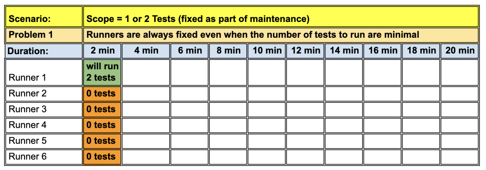

# RunWright

> If you want to skip reading the context and go directly to getting started section, click [here](#getting-started). 

## 🚀 Core features

- **Time-based completion**: Finish thousands of tests in your target timeframe (2-5 minutes).
- **Dynamic auto scaling**: Auto-adjust runners based on test load.
- **Smart distribution**: Balance workload by execution time, not test count.

In below example, we see more than three thousand tests run in just 1.5 minutes with a desired run time of 2 mins in total. 

## Scope

This action covers both execution modes in Playwright. i.e.
- When `fullyParallel=true`. [ Parallel run all individual test cases on runners]
- When `fullyParallel=false`. [ Parallel run all individual test files on runners]

## Why this action? What's wrong with Playwright Sharding?

We will explain this by looking into details of how Playwright Sharding works and what problems it brings with its implementation. 

## With Playwright Sharding
[Playwright Sharding](https://playwright.dev/docs/test-sharding#introduction) is a out-of-the-box solution from Playwright to allow distributed runs on any machine. Its inner workings and GitHub usage examples has two main flaws.

### 1. Playwright sharding results into uneven test distribution on runners.

Playwright sharding distributes tests based on the **total count of tests ([balancing shards](https://playwright.dev/docs/test-sharding#balancing-shards)) and not based on how much time each test takes to complete**. Since **sharding is not time aware of every test while distribuing tests on runners**, it results into situations as below.

### 2. Fixed runners, that do not scale up or down based on the test load. 

Playwright gives a [GitHub actions example](https://playwright.dev/docs/test-sharding#github-actions-example) that shows how we can use a  `GitHub matrix strategy` to distribute tests on **fixed number or runners** (4 in the given example). This results into inefficiencies as shown below.

## With RunWright

## 1. Even test load distribution, based on your pre-decided total run time wishes, to finish tests.

## 2. Dynamic runners, that scale up or down based on test load.

## Pros and Cons: Playwright Sharding vs RunWright

| Aspect | 🚫 Playwright Sharding | ✅ RunWright |
|--------|------------------------|-------------|
| **Timely feedback on pull requests** | 🐌 Test runs that take long time **cannot be run with every pull request**. | ⚡️ Fast and predictable run times makes it **possible to run system tests with every PR**. |
| **Trust on Tests** | 📉 **Tests that aren't run with each PR, doesn't get fixed with each PR**. They are often run after the new changes are already merged in the main branch. As seen frequently, such tests give **false positives** due to new changes and **breaks teams trust** in them. | 📈 **Tests that are run with every PR gets fixed with the PRs**. They provide timely feedback to developers, give **true positives** and **improve trust of team** in them. |
| **Maintenance Fatigue** | 😩 Tests that are not fixed with PRs gets passed on to QAs. When this happens frequently, which it often does, it results into **maintenance fatigue in QAs**. QAs find themselves **demotivated and stuck in this never ending cycle of fixing broken tests, with little to no time to do anything else that is meaningful.** | 😇 **When developers are responsibile for fixing the tests** that are broken due to their own changes, **it frees up time for testers in the team to do more meaningful work such as exploration testing, writing new tests for missing functionality,  learning new ways of testing and mentoring team members** on testing and automation. |
| **To increase Test Coverage or not?** | 📉 Increased test run times **creates pressure on team to limit test suite growth and over optimise** existing tests rather than adding new tests to increase test coverage. | 📈 When teams have a solution and a setup that can always finish test in a fixed time (say 2 to 5 mins), it **encourages them to write new tests to increase test coverage for missing functionality and not worry about over optimization** to keep run-times in check. |
| **Runner Scaling Efficiency** | 📉 **Adding more runners has diminishing returns** and doesn't guarantee proportional time savings | 💡 **Smart auto-scaling based on test load gives consistent and directly proportional performance benefits** |
| **Costs and returns** | 💸 As we have seen, with more added runners the **infrastructure costs grow in proportion but with diminishing performance results**. | 💰 **Infrastructure costs are always in proportion to our test run demands and we only pay for what we use**. Nothing more. Nothing less. |
| **Scalability Potential** | 🔒 **Approach doesn't scale well with increased amount of tests**. | 🚀 **Excellent scalability that grows efficiently with test suite expansion, and always keeping total run time fixed to our desired times (say 2 to 5 mins irrespective of total tests to run)** |

**Key Takeaway:** RunWright transforms system testing from a burden into an enabler, allowing teams to maintain fast feedback loops while scaling their test suites confidently.

> ** At the time of writing this document, there are no known other solutions (paid or open source), that can do this using Playwright and GitHub.

## 💡 So how does it work?

To build a solution that is "time aware", and that can "auto-scale" based on the "current test-load", there are a few things that we need. 

🔁 i.e.:
-  Σ T_i = TestRunTimeForEachTest(i) = execution time of test i (from state.json)
   - We get this value from [`state.json`](https://github.com/PramodKumarYadav/playwright-sandbox/blob/main/state.json) file that is generated using a custom [state-reporter.js](https://github.com/PramodKumarYadav/playwright-sandbox/blob/main/state-reporter.js) file and commited on a post-commit hook.
-  N = total number of tests to run.
   - We get the test scope by running playwright command with [`--list`](https://playwright.dev/docs/test-cli#all-options) option.
-  TargetRunTime = total desired time to complete the run (in minutes)
   - We get this as [input from the user](https://github.com/PramodKumarYadav/playwright-sandbox/blob/main/.github/workflows/run-any-tests-on-demand-sandbox.yml). 
-  TotalLoad = Σ T_i = total test load (in terms of test run time)
   - We iterate over each runner to keep the `Σ T_i <= TargetRunTime`. 
   - Note that the total run time for each runner is affected by the number of parallel threads and is explained in more details in the next section.
-  Threads (Parallel threads per runner).
   - [Recommended Threads per runner](https://learn.microsoft.com/en-us/azure/playwright-testing/concept-determine-optimal-configuration) is half of cores; i.e. (Threads = Cores / 2). 
-  Cores = number of cores per runner.
   - For Linux runners, `NUM_CORES=$(nproc)`
-  Runners = Total number of required runners.
   - We calculate this as shown in the next section by using all this available information.

📐 Equation

Since we know every individual TestRunTimeForEachTest(i) from state.json, the total workload is:

Total parallel capacity available on the runners:

Equating Load and Capacity:

Solving for Runners:

Finally, we piece all this information together in this custom [runwright](https://github.com/marketplace/actions/runwright) GitHub action and give you:
   - a `dynamic-matrix` 
   - and `test-load-distribution-json` as output variables.

## How does the end to end setup looks like?

### Locally
- Dev/Tester adds/updates a test.
- Tries to commit changes. 
- Pre-Commit git hook automatically runs `npx playwright test --only-changed` command to run tests. 
- Custom [state-reporter.js](https://github.com/PramodKumarYadav/playwright-sandbox/blob/main/state-reporter.js) which is added in [playwright.config.ts](https://github.com/PramodKumarYadav/playwright-sandbox/blob/main/playwright.config.ts) file as a reporter, runs after the tests are finished; running and updating the [state.json](https://github.com/PramodKumarYadav/playwright-sandbox/blob/main/state.json) file with the affected test runs time.
- The changes staged at the time of running pre-commit hook are commited (except the state.json file which is updated as a result of pre-commit hook itself).
- Post commit, a post-commit hook runs and commits the state.json file as well (skipping running of pre commit hooks again).

### Remote (on GitHub)
- User provides a desired total run time (either pre-defined-and-hard-coded for pull-request/push triggers, to say 2 or 4 minutes or by giving manually, if using a workflow dispatch workflow).
- Based on the above `input run time`, and the information in `state.json` file, `runwright` action have all the information to calculate minimum required runners as per test load.
- The exact tests that needs to run on each runner are also calculate and received from the action to the caller workflow. 
- Each runner then runs the tests in its scope and creates a `blob report` for the tests that it has run. 
- Once all runners are finished running tests, another job consolidates all the `blob reports` to create a consolidated `final test report`.
- You can now verify if the total test run time was within your desired run time wishes. Your desired total run time should be always a little higher than your slowest tests, since that is your limiting factor. Tip: If you have very lengthy tests, try breaking them down into smaller atomic or partial integration tests. 

## Getting Started

There are 3 main steps involved:

### Step1: One time setup (in your test project)

- [Install latest version of Node (or at least >=18)](https://nodejs.org/en)
- [Install husky in your test project](https://typicode.github.io/husky/get-started.html).
- Add a `pre-commit` hook file as shown [here](https://github.com/PramodKumarYadav/playwright-sandbox/blob/main/.husky/pre-commit).

   - This will run `--only-changed` tests on local commits.

- Copy [state-reporter.js](https://github.com/PramodKumarYadav/playwright-sandbox/blob/main/state-reporter.js) file and put it in the root repository.

   - This will create a [`state.json`](https://github.com/PramodKumarYadav/playwright-sandbox/blob/main/state.json) file that contains the mapping of test path and the time it took to run (in ms).

- Update [playwright.config.ts](https://github.com/PramodKumarYadav/playwright-sandbox/blob/main/playwright.config.ts) file reporters to include this reporter as shown below.
   `reporter: [["list"], ["html"], ["github"], ["./state-reporter.js"]],`
- Add a `post-commit` hook file as shown [here](https://github.com/PramodKumarYadav/playwright-sandbox/blob/main/.husky/post-commit).

   - This will automatically stage and commit the updated [`state.json`](https://github.com/PramodKumarYadav/playwright-sandbox/blob/main/state.json) file to the feature branch.

- Add a [reusable workflow](https://github.com/PramodKumarYadav/playwright-sandbox/blob/main/.github/workflows/reusable-workflow.yml) that can take inputs from user to run playwright commands and finish tests in x mins.
- Add a example [trigger workflow](https://github.com/PramodKumarYadav/playwright-sandbox/blob/main/.github/workflows/run-all-tests-on-push-to-main.yml) that shows how to use the reusable workflow to run desired tests. Here are a few examples of `trigger workflows`.
   - [run selected tests on demand](https://github.com/PramodKumarYadav/playwright-sandbox/blob/main/.github/workflows/run-any-tests-on-demand.yml)
   - [run only new or updated tests in a pull request](https://github.com/PramodKumarYadav/playwright-sandbox/blob/main/.github/workflows/run-only-touched-tests-on-pull-requests.yml)
   - [run all tests on a push to main](https://github.com/PramodKumarYadav/playwright-sandbox/blob/main/.github/workflows/run-all-tests-on-push-to-main.yml)

### Step2: Run tests based on the defined triggers (push to main, pull_request to main, schedule, on demand etc all)

- To test the setup use one of below workflows (either in your own test repository or fork the above sandbox repository to try out).
   - [run selected tests on demand - using reusable workflow that points to a fixed version say v2.1.0 of runwright action](https://github.com/PramodKumarYadav/playwright-sandbox/blob/main/.github/workflows/run-any-tests-on-demand.yml)
   - [run selected tests on demand - using standlone workflow - that points to the latest main version of runwright action](https://github.com/PramodKumarYadav/playwright-sandbox/blob/main/.github/workflows/run-any-tests-on-demand-sandbox.yml)

> For reference, a example-workflow.yml file is also available in the root of the RunWright GitHub project. 

### Step3: Report found issues

- If you find any issues, use the [issues page](https://github.com/PramodKumarYadav/runwright/issues) to raise them.

## Things to remember

- Do not use sharding related commands in the input playwright command to run; since this solution is meant to overcome the flaws of sharding. Using sharding again would introduce those short comings again.
- If you are using custom powerful GitHub runners, use the same custom runner type for job that evaluates "RunWright" then what you would use in subsequent job for running tests. This is important to correctly calcualte the workers (threads), which is half of cores of the runners.

## 🧪 Tests

| Sr No | Test Description | Test Condition | Expected Result | Actual Result | Status |
|-------|------------------|----------------|-----------------|---------------|---------|
| 1 | Run with 0 tests found | `npx playwright test --grep="non-existent-test"`  | Action should handle gracefully, set RUNNER_COUNT=1, and exit successfully | ✅ Action exits gracefully with "No tests found" message | ✅ [PASS](https://github.com/PramodKumarYadav/playwright-sandbox/actions/runs/16179518780) |
| 2 | Test with fullyParallel=true | `npx playwright test` with -fully-parallel=true | Should distribute individual tests across runners | ✅ Looking into runwright job, we can see that tests from same file are distributed across different runners | ✅ [PASS](https://github.com/PramodKumarYadav/playwright-sandbox/actions/runs/16179632442/job/45673015976) |
| 3 | Test with fullyParallel=false | `npx playwright test` with -fully-parallel=false | Should distribute tests files across runners | ✅ File-level distribution works correctly. No tests from same file + project seen in different runners. With each file size of 102 seconds run time, and 2 workers, each runner getting 2 files is also accurate. Slowest runner time was 2 mins 48 seconds. Total run time in html report = 1.9m | ✅ [PASS](https://github.com/PramodKumarYadav/playwright-sandbox/actions/runs/16179919403/) |
| 4 | Run with very few tests (with < 2 min total run time) | `npx playwright test --grep='Wait for 5 seconds'` | Should create 1 runner with optimal worker allocation | ✅ Creates 1 runner, completes in less than <2 mins> | ✅ [PASS](https://github.com/PramodKumarYadav/playwright-sandbox/actions/runs/16179545717) |
| 5 | Run with all tests (~30 mins when run sequentially) | `npx playwright test` | Should create around 8 runners with optimal worker allocation | ✅ Creates 9 runners. Slowest runner time was 2 mins 59 seconds. Total run time on html report: 2.1m | ✅ [PASS](https://github.com/PramodKumarYadav/playwright-sandbox/actions/runs/16179792471) |
| 6 | Run ~1.5k tests in 2 minutes | [Test Command Placeholder] | Should create optimal number of runners to finish within 2 minutes | ✅ Completes in ~2 minutes with dynamic runner allocation (as seen in the early tests image. runner id  not available) | ✅ PASS |
| 7 | Run ~3k tests in 2 minutes | `npx playwright test` | Should scale up runners appropriately to meet time constraint | ✅ Scales to multiple runners, finishes in ~2 minutes | ✅ [PASS](https://github.com/PramodKumarYadav/playwright-sandbox/actions/runs/13400398360) |
| 8 | Test missing from state.json | Delete tests from file06 for 20,25 seconds for firefox in state.json. Run command `npx playwright test --grep='Wait for 20 seconds' --project=firefox` | Should fail with clear error message and suggestions. No grace failure to avoid "false positive" situation from runs. | ✅ Provides clear error with post-commit hook guidance | ✅ [PASS](https://github.com/PramodKumarYadav/playwright-sandbox/actions/runs/16180170072/) |
| 9 | Single project configuration | `npx playwright test --project='chromium'` | Should work with single browser project | ✅ Handles single project scenarios correctly | ✅ [PASS](https://github.com/PramodKumarYadav/playwright-sandbox/actions/runs/16180235559) |
| 10 | Multiple project configuration | `npx playwright test --project='chromium' --project='webkit'` | Should group tests by project within runners | ✅ Correctly groups and distributes multi-project tests | ✅ [PASS](https://github.com/PramodKumarYadav/playwright-sandbox/actions/runs/16180268230) |
| 11 | CPU core detection | [check any of previous runs] | Should detect available cores and calculate optimal workers | ✅ Detects cores correctly, sets workers = cores/2 | ✅ PASS |
| 12 | Dynamic matrix generation | [check any of previous runs] | Should create proper GitHub Actions matrix format | ✅ Generates valid JSON array for matrix strategy | ✅ PASS |
| 13 | Load balancing accuracy | [check any of previous runs] | Distribution should be based on execution time, not test count | ✅ Uses actual test execution times for optimal distribution | ✅ PASS |
| 14 | Runner utilization | [check any of previous runs] | All runners should finish at approximately the same time | ✅ Even load distribution across all runners | ✅ PASS |
| 15 | Browser caching | [check any of previous runs] | Should cache and reuse Playwright browsers efficiently | ✅ Implements proper browser caching strategy | ✅ [PASS](https://github.com/PramodKumarYadav/playwright-sandbox/actions/runs/16180268230/job/45675077743) |
| 16 | Error handling for malformed state.json | [Test Command Placeholder] | Should provide clear error when state.json is corrupted | ✅ Handles JSON parsing errors gracefully | ✅ PASS |
| 17 | Large test suite scalability | run with .5 seconds (before putting a restriction for minimum time) | Should handle test suites with 5k+ tests efficiently | ✅ Scales appropriately for large test suites (tested with tests of size 3k+) | ✅ [PASS](https://github.com/PramodKumarYadav/playwright-sandbox/actions/runs/16180627144) |
| 18 | Custom runner types compatibility | [Test Command Placeholder] | Should work with custom GitHub runner configurations | ✅ Compatible with custom runner specifications | ？ NOT-YET-TESTED |
| 19 | Output format validation | [check any of previous runs] | All outputs should be valid JSON and consumable by workflows | ✅ All outputs are properly formatted and consumable | ✅ PASS |
| 20 | Invalid time input (< 1 minute) | [Test Command Placeholder] | Should handle minimum time constraint appropriately | ✅ Validates minimum 1 minute requirement | ✅ [PASS](https://github.com/PramodKumarYadav/playwright-sandbox/actions/runs/16180781972) |

## Troubleshooting

- It could be a good idea to generate the [`state.json`](https://github.com/PramodKumarYadav/playwright-sandbox/blob/main/state.json) file from scratch every few days or weeks to avoid having redundant test path and names.

## Whats next?

- [ ] Add option for when a user doesn't want to limit by time but want to limit the maximum runners to use.

## Like my work and want to support or sponsor?

